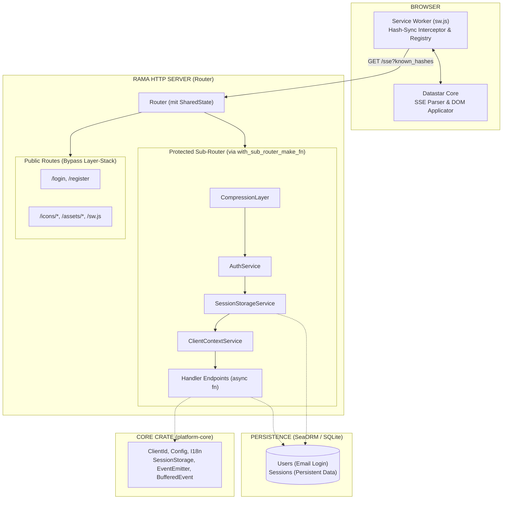

Hier ist die komplette, konsolidierte und final korrigierte `prompt.md`. Du kannst den gesamten Inhalt 1:1 kopieren und deine alte Datei überschreiben. Alle unsere besprochenen Änderungen (Rama-Native Routing, Layer-Funktionen, SharedState vs. ClientContext, BufferedEvent, 204 No Content, Email-Login, Volatile-Storage, Testing-Route) sind integriert.

---

# PROJECT SPECIFICATION — Rama Platform

> **Version:** 0.0.1  
> **Last revised:** N/A
> **Status:** Currently not in Development  
> **Canonical source:** This document. All implementation decisions derive from here.

---

## PART 0 — CORE DIRECTIVE (ABSOLUTE RULE)

Treat local reference material as the **only** source of truth.  

Wenn etwas nicht existiert:
→ explizit sagen  
→ nicht approximieren  
→ nicht ersetzen

**Keine erfundenen APIs. Keine angenommenen Frameworks.**

---

## PART 1 — VISION & ARCHITECTURE

### 1.1 Vision

Eine lokal dokumentationsgetriebene Fullstack-Webplattform mit:

- **Rust** Backend auf Basis der Rama-HTTP-Architektur (v0.3.0-alpha.4)
- **Datastar** als einziges Frontend-Reaktivitätssystem (SSE-first)
- **SeaORM** als Persistenzschicht (SQLite)
- **Tokyo Night** Design System (GNOME/libadwaita-inspiriert)
- **Hash-Sync** Caching via Service Worker (ring-basierte HMAC-SHA256)

### 1.2 Architektur-Übersicht



### 1.3 Crate-Architektur (SOLID)

| Crate | Verantwortung | Abhängigkeiten |
|-------|--------------|----------------|
| `platform-core` | Domänen-Typen, Config, I18n, SessionStorage, EventEmitter, BufferedEvent | `uuid`, `serde_json`, `ring`, `sea-orm`, `chrono` |
| `platform-backend` | HTTP-Server, Router, Layer, Handler, SSE-Broadcaster, Assets | `platform-core`, `rama`, `tokio`, `async-stream` |

**Wichtig:** `platform-core` hat **keine** Abhängigkeit auf `rama`. Die nativen Rama-Typen (`PatchElements` etc.) werden erst im Backend in den `BufferedEvent` gewrapped.

**Interface-Vertrag `platform-core` → `platform-backend`:**
- `ClientId` — UUID-basierter Client-Identifier (immutable value object)
- `ClientContext` — Aggregat aus ClientId + SessionStorage + EventEmitter + Arc<SseBroadcaster> (per-Request, immutable nach Konstruktion)
- `SessionStorage` — JSON-basierter Session-State mit StorageMode pro Pfad
- `EventEmitter` — Einfacher Event-Puffer mit `buffer_event()` / `get_buffered_events()`
- `BufferedEvent` — Wrapper für Rama-Events inkl. HMAC-Hash (16 Bytes / 128 Bit, hex-enkodiert) für den Broadcaster
- `Config` — Singleton-Konfiguration aus Environment-Variablen
- `I18n` — Immutable Übersetzungs-Map mit DB-Override-Fähigkeit

**Single Responsibility:**
- `platform-core` = pure Domäne, keine I/O
- `platform-backend` = HTTP/I/O, keine Domänenlogik

### 1.4 Technologie-Entscheidungen (ADR)

| ADR | Entscheidung | Begründung |
|-----|-------------|-----------|
| ADR-001 | Rama statt Axum/Actix | Architektur-Vorgabe; Layer-System nativ unterstützt |
| ADR-002 | Datastar SSE-only | Kein alternatives UI-State-System; einziges Reaktivitätsmedium |
| ADR-003 | SeaORM + SQLite | Bekannte ORM-API; SQLite für Zero-Config-Entwicklung |
| ADR-004 | ring für Kryptographie | HMAC-SHA256 für Hash-Sync; deterministisch über Server-Restarts hinweg |
| ADR-005 | Service Worker Caching | Hash-basiertes Dedup ohne Custom-Protokoll |
| ADR-006 | `tokio::sync::broadcast` | Multi-Client-SSE; `mpsc::unbounded` nur für 1:1 |
| ADR-007 | Kein `mod.rs` mit Logik | `mod.rs` nur für `pub mod` + Re-Exports; Implementierungen in benannten Dateien |
| ADR-008 | `Router<State>` Bifurkation | Trennung Public/Protected via `with_sub_router_make_fn`, kein custom RouterService |
| ADR-009 | `rama::layer::layer_fn` | Keine eigenen Layer-Structs, Layer werden als Closures um Services gewrapped |
| ADR-010 | Login via Email | Email ist der eindeutige Login-Identifier; Username nur für Anzeige |
| ADR-011 | `204 No Content` für SSE-Trigger | GET-Requests, die nur SSE-Events auslösen, returnieren sofort 204; UI-Update asynchron via SSE |
| ADR-012 | E2E Test-Route `/test` | Stellt sicher, dass Caching/Hash-Sync zwischen Rust/SW fehlerfrei funktioniert; direkt in der App sichtbar |
| ADR-013 | `ClientContextSseExt` Extension Trait | Trennt Rama-spezifische SSE-Logik von `platform-core`; nur `platform-backend` kennt Rama-Typen |
| ADR-014 | Hash-Trunkierung auf 128 Bit | `ring::hmac::HMAC_SHA256` Tag auf 16 Bytes kürzen vor hex-Enkodierung; effizienter Hash-Sync im SW |

---

## PART 2 — KOMPONENTEN-SPEZIFIKATION

### 2.1 Client Identifier System

**Zuständig:** `platform-core::client_id` + `platform-backend::layers::auth`

| Anforderung | Spezifikation |
|------------|--------------|
| UUID v4 Generierung bei Erstbesuch | `ClientId::new()` via `uuid::Uuid::new_v4()` |
| Cookie-basierte Speicherung | `platform_cid`, HttpOnly, SameSite=Lax, Path=/ |
| Fallback | Niemals einen Request wegen fehlender ID ablehnen; immer generieren |
| TTL | 30 Tage default, konfigurierbar via `CLIENT_ID_TTL_DAYS` |
| Remember-Me | Checkbox bei Login verlängert TTL (365 Tage) |

**Interface:**
```rust
// platform-core
pub struct ClientId(pub uuid::Uuid);
pub const CLIENT_ID_COOKIE: &str = "platform_cid";
pub fn generate() -> ClientId;
pub fn parse(s: &str) -> Option<ClientId>;
```

### 2.2 Layer-Architektur (via `layer_fn`)

**Reihenfolge (kritisch — nicht ändern):**

```
CompressionLayer -> AuthService -> SessionStorageService -> ClientContextService -> Handler
```

| Service | Verantwortung | Input (Extensions) | Output (Extensions) |
|---------|--------------|-------------------|---------------------|
| AuthService | ClientId validieren/generieren, Cookie setzen | Cookie-Header | `ClientId` |
| SessionStorageService | SessionStorage rehydrieren/erstellen | `ClientId` | `SessionStorage` |
| ClientContextService | ClientContext aggregieren | `ClientId`, `SessionStorage` | `ClientContext` |

**Implementierung:**
Keine eigenen `AuthLayer` / `SessionStorageLayer` Structs! Nutzung von `rama::layer::layer_fn`:
```rust
// Beispielhaft im Server-Setup:
.layer(CompressionLayer::new())
.layer(layer_fn(|inner| AuthService::new(inner)))
.layer(layer_fn(|inner| SessionStorageService::new(inner)))
.layer(layer_fn(|inner| ClientContextService::new(inner)))
```

### 2.3 Routing-System (Rama Native)

**Bifurkation via `with_sub_router_make_fn`:**

| Typ | Pfade | Methode |
|-----|-------|---------|
| Public Routes | `/login`, `/register`, `/icons/*`, `/assets/*`, `/sw.js` | Direkt am Haupt-Router registriert |
| Application Routes | `/home`, `/home/movies`, `/home/series`, `/sse`, `/api/i18n` | Im Sub-Router (Präfix `/`) mit Layer-Stack |
| Test Route | `/test` | Im Sub-Router (Protected). Dient als E2E-Test-Harness für Hash-Sync & Caching |

**Aufbau:**
1. `Router::new_with_state(shared_state)` (Haupt-Router)
2. Public Routes direkt via `with_get()`, `with_dir()`, etc. anmelden.
3. `with_sub_router_make_fn("/", |sub_router| { sub_router.with_get(...).layer(...) })` für den geschützten Bereich.

### 2.4 SharedState vs. ClientContext

**SharedState (Global Server-Scope):**
- Wird via `Router::new_with_state()` injiziert.
- Enthält: `Config`, `DatabaseConnection`, `I18n`, `Arc<SseBroadcaster>`.
- Lebenszyklus: Existiert einmalig solange der Server läuft.

**ClientContext (Per-Request-Scope):**
- Wird von den Layern in `req.extensions()` injiziert.
- Enthält: `ClientId`, `SessionStorage`, `EventEmitter`, `Arc<SseBroadcaster>`.
- Lebenszyklus: Wird pro Request erstellt und nach Response verworfen.

Handler extrahieren `SharedState` via `State(state)` und `ClientContext` via Utility-Funktion `extract_context(&req)` (liest aus `req.extensions()`).

### 2.5 SessionStorage + EventEmitter

**SessionStorage** (`platform-core::session`):
- JSON-basiert pro Client
- 3 Storage-Modi: `FireAndForget`, `Volatile`, `Persistent`
- Selektives Senden via JSON-Path (`emit_path`)
- Entwickler bestimmt Mode zur Laufzeit
- Nur `Persistent`-Daten werden via SeaORM in die Datenbank geschrieben

**EventEmitter** (`platform-core::event_emitter`):
- Einfacher Event-Puffer (kein Namespace, kein Hash-Tracking)
- `buffer_event(event: BufferedEvent)` / `get_buffered_events()` / `drain_all_events()`

### 2.6 SSE + Hash-Sync System (KRITISCH)

**Das `BufferedEvent` Pattern:**
Ramas native Typen (`PatchElements`, etc.) besitzen kein Feld für unseren Custom-Hash. Daher wrappt das Backend diese in ein internes `BufferedEvent` (definiert in `platform-core`, da `platform-core` keine Rama-Abhängigkeit hat, ist das Payload-Feld ein generischer Rama-Typ, der erst im Backend konkretisiert wird):
```rust
pub struct BufferedEvent {
    pub hash: String, // HMAC-SHA256, auf 16 Bytes (128 Bit) gekürzt, hex-enkodiert
    pub payload: rama::http::body::sse::datastar::PatchElements, // oder PatchSignals, ExecuteScript
}
```

**Hash-Trunkierung:** Der `ring::hmac::HMAC_SHA256`-Tag wird auf 16 Bytes (128 Bit) gekürzt vor der hex-Enkodierung — für effizienteren Hash-Sync im ServiceWorker.

**Protokoll (Push-Only):**

```
Phase 1 — Replay (im SseEndpoint):
  Client → GET /sse?known_hashes=abc,def,xyz
  Server → replayt ALLE gebufferten BufferedEvents (iter, NOT drain!)
  Server → skippt Events deren Hash in known_hashes (nur PatchElements)
  Server → konvertiert verbleibende BufferedEvents in Rama SSE Body

Phase 2 — Push:
  Server → sendet neue BufferedEvents via SseBroadcaster broadcast::channel
  Server → PUSH ONLY, keine confirmed/evicted Events

Service Worker:
  - Intercepted fetch('/sse') → hängt known_hashes an URL
  - Speichert NUR PatchElements-Hashes (In-Memory Set)
  - TTL: 24 Stunden
  - Parsed Event-Inhalt NICHT (Datastar Core macht das)
```

**Navigation & Sidebar (Beispiel `/home/movies`):**
1. Klick im Frontend löst `GET /home/movies` aus.
2. `NavigateHandler` lädt statischen HTML-String (via `include_str!`).
3. Handler erzeugt `BufferedEvent(PatchElements)` und broadcastet es über den `SseBroadcaster`.
4. Handler returniert **sofort `204 No Content`**.
5. Frontend erhält das neue HTML asynchron über den SSE-Stream und Datastar patched den DOM (`#content` Selector).

**Hash-Generierung:** `ring::hmac::HMAC_SHA256` über Event-Daten (z.B. HTML-String), auf 16 Bytes (128 Bit) kürzen, hex-enkodieren. **WICHTIG:** Nicht Rusts `std::hash::Hash` nutzen (dieser ist randomisiert über Programmstarts, was den SW-Cache invalidieren würde).

**ClientContextSseExt:** In `platform-backend` definiertes Extension Trait auf `ClientContext`, das die Methode `emit_patch(data_to_hash, patch, should_cache)` bereitstellt. Diese wrappt den Rama-Payload in ein `BufferedEvent`, berechnet den HMAC-Hash und sendet das Event an den `SseBroadcaster` (und optional an den `EventEmitter`).

### 2.7 Persistenz (SeaORM)

| Anforderung | Spezifikation |
|------------|--------------|
| SeaORM als einzige ORM-Schicht | `sea-orm` 1.1 mit `sqlx-sqlite`, `runtime-tokio-native-tls`, `macros` |
| SQLite-Datenbank | `DATABASE_URL="sqlite://platform.db?mode=rwc"` |
| Login-Identifier | **Email** (UNIQUE) zum Einloggen; Username (UNIQUE) nur für Anzeige |
| Datenbank-Verbindung | `SharedState.db: DatabaseConnection` |
| Migrations | Ausschließlich via `sea-orm-cli` (NIEMALS von Hand) |
| SessionStorage-Persistenz | Nur `StorageMode::Persistent` schreibt via SeaORM in DB `Json data` Feld |

### 2.8 I18N System

- `assets/i18n/{de,en}.json` — Fallback-Übersetzungen
- `$i18n.<key>` via Datastar PatchSignals
- DB-Override via SeaORM (spätere Phase)
- Sprach-Erkennung via `Accept-Language` Header

### 2.9 UI / Design System

**Struktur:**
```
pages/
  login.html
  register.html
  home.html
  home_overview.html
  home_movies.html
  home_series.html
  test.html
```

**Design-Regeln & Architektur:**
- Tokyo Night CSS als kanonische Referenz
- Dark + Light Mode in separaten Files (`dark.css`, `light.css`)
- Soft Contrast (KEIN Neon, KEIN Cyberpunk)
- Uniform CSS (ein Regelsatz für alle Buttons, Inputs, etc.)
- GNOME/libadwaita-Spacing: große Padding, weiche Elevation, runde Oberflächen
- Floating centered window (NICHT fullscreen)
- Layout: Sidebar + Main Content + Header + Footer
- **Statisches HTML:** Seiteninhalte (z.B. Movies/Overview) werden zur Laufzeit nicht durch String-Concatenation generiert, sondern als statische String-Literals (`include_str!`) geladen und via `PatchElements` als Ganzes ausgeliefert.

### 2.10 Icons

- GNOME Icon Development Kit als Quelle
- Handler: `/icons/{name}.svg`
- SVG via `include_str!` eingebettet

### 2.11 Config / Environment

- Singleton via `std::sync::OnceLock`
- `std::env` mit Fallback-Werten
- Variablen: `DATABASE_URL`, `HOST`, `PORT`, `RUST_LOG`, `CLIENT_ID_TTL_DAYS`, `SSE_TTL_DAYS`, `HMAC_SECRET`

### 2.12 Testing & Hash-Sync Verification

Um die Komplexität des Hash-Sync-Mechanismus und die verschiedenen Caching-Stufen zuverlässig zu garantieren, wird ein zweistufiges Test-System implementiert:

**1. Service Worker Mock + Jest (Unit/Integration):**
- Der Service Worker (`sw.js`) wird isoliert mit Jest getestet.
- Mocking des `fetch`-APIs, um SSE-Streams mit definierten Hash-Werten zu simulieren.
- Überprüfung der In-Memory Hash Registry (TTL, Deduplizierung, Größenbeschränkung).
- Validierung, dass `known_hashes` korrekt an die URL angehängt werden.

**2. E2E Test-Harness via `/test` Route:**
- Die Plattform stellt eine geschützte Route `/test` bereit.
- Ruft der Client diese auf, wird eine spezielle Test-HTML-Seite ausgeliefert, die vollständig von Datastar gesteuert wird.
- **Automatisierter Ablauf:**
  1. Das Backend feuert eine definierte Sequenz von `BufferedEvents` (Kombinationen aus neuen, bekannten, veralteten und out-of-order Events) an den `SseBroadcaster`.
  2. Der Client (ServiceWorker + Datastar) verarbeitet diesen Stream.
  3. Die Test-Seite enthält Datastar-Signals, die bei erfolgreicher Verarbeitung (oder bei fehlerhaftem DOM-Update) gesetzt werden.
  4. Ein finales Datastar-Signal berechnet den **Test-Score** (z. B. `10/10 Caching-Kombinationen korrekt verarbeitet`).
- **Zweck:** Ermöglicht manuelle oder automatisierte Browser-Tests, um sicherzustellen, dass der Hash-Sync zwischen Rust-Backend (ring HMAC) und Frontend (SW Registry) exakt synchronisiert ist.

---

## PART 3 — IMPLEMENTIERUNGS-RESTRIKTIONEN

| # | Regel | Begründung |
|---|-------|-----------|
| ❌0 | **KEINE** Logik in `mod.rs` | `mod.rs` nur für `pub mod` + Re-Exports |
| ❌1 | **KEINE** String-Concatenation für UI | Statische HTML-Strings laden und via Datastar PatchElements nutzen |
| ❌2 | **KEINE** eigenen Layer-Structs | Rama `layer_fn` nutzen, um Services als Layer zu wrappen |
| ❌3 | **KEINE** undokumentierten Side Effects | Jeder State-Change muss via EventEmitter/SSE nachvollziehbar sein |
| ❌4 | **KEIN** Page-spezifisches CSS | Globale Styles in `common.css` mit CSS Custom Properties |
| ❌5 | **KEIN** eigenes JS für UI-State | Nur Datastar SSE-Events für Reaktivität |
| ❌6 | **KEIN** `std::hash::Hash` für Hash-Sync | Hash ist randomisiert; zwingend `ring::hmac` für deterministische Hashes nutzen |
| ❌7 | **KEINE** synchronen Wartezeiten bei SSE-Triggern | GETs, die SSE auslösen, returnieren sofort `204 No Content` |

### 3.1 Performance-Regeln

- ❌ Keine Full-DOM-Rebuilds → `PatchElements` mit `data-datastar-selector`
- ❌ Keine String-Generierung zur Laufzeit für statische Seitenbereiche
- ✅ `PatchSignals` für reaktive Updates
- ✅ `PatchElements` für strukturelle Updates
- ✅ `204 No Content` für asynchrone UI-Updates via SSE

---

## PART 4 — REFERENZ-INDEX

### 4.1 Lokale Referenzen

| Pfad | Inhalt |
|------|--------|
| `references/rama-api.md` | Rama 0.3.0-alpha.4 HTTP Server API (Crashkurs) |
| `references/rustdoc-rama-0.3.0-alpha.4/` | Vollständige Rama-Rustdoc |
| `references/sea-orm-1.1.19/` | SeaORM Dokumentation + Beispiele |
| `references/rustdoc-ring-0.17.14/` | Ring-Kryptographie-Dokumentation |
| `references/datastar/` | Datastar SDK + Beispiele |
| `references/icon-development-kit/` | GNOME Icon Development Kit (SVGs) |
| `references/Tokyonight-dark.css` | Tokyo Night Dark Theme Referenz |
| `references/Tokyonight-light.css` | Tokyo Night Light Theme Referenz |

### 4.2 Wichtige Rama-Crates (alphabetisch)

| Crate/Modul | Verwendung |
|-------------|-----------|
| `rama::extensions::{ExtensionsRef, ExtensionsMut}` | Request-Extensions für Layer-Kommunikation |
| `rama::http::body::sse::datastar::*` | Datastar SSE Events (PatchSignals, PatchElements, ExecuteScript) |
| `rama::http::body::sse::Sse` / `SseResponseBody` | SSE-Streaming |
| `rama::http::server::HttpServer` | Server-Erstellung + Binding |
| `rama::http::service::web::Router` | Natives Routing mit State-Injektion & Bifurkation |
| `rama::layer::Layer` | Layer-Trait für Middleware |
| `rama::layer::layer_fn` | Erzeugt Layer aus Closures (ohne eigene Structs) |
| `rama::service::Service` | Service-Trait für Request-Verarbeitung |
| `rama::http::layer::compression::CompressionLayer` | Automatische Response-Komprimierung |

### 4.3 Externe Crates

| Crate | Version | Verwendung |
|-------|---------|-----------|
| `tokio` | 1.x | Async Runtime + `sync::broadcast` |
| `serde` / `serde_json` | 1.x | Serialisierung |
| `uuid` | 1.x (v4, serde) | ClientId-Generierung |
| `ring` | 0.17.14 | HMAC-SHA256 für Hash-Sync; `hmac`, `rand` |
| `sea-orm` | 1.1.x | ORM (SQLite via `sqlx-sqlite`) |
| `async-stream` | 0.3.x | SSE-Stream-Generierung |
| `tracing` / `tracing-subscriber` | 0.1.x / 0.3.x | Strukturiertes Logging |
| `chrono` | 0.4.x | Timestamps für TTL-Berechnung |

### 4.4 Hash-Sync Edge Cases (Spec §2.6)

Diese Edge Cases müssen in der SSE-Implementierung korrekt behandelt werden:

| Edge Case | Beschreibung | Erwartetes Verhalten |
|-----------|-------------|---------------------|
| **EC-1: Hash Match** | Inhalt identisch (gleicher HMAC) | Hash entscheidet → Event wird übersprungen (Inhalt bereits bekannt) |
| **EC-2: Hash Mismatch** | Anderer Hash (Inhalt hat sich geändert) | Hash entscheidet → Event wird verarbeitet |
| **EC-3: Out-of-order Events** | Events kommen in anderer Reihenfolge | Jedes Event wird einzeln gegen known_hashes geprüft |
| **EC-4: Hash-Kollision** | Zwei unterschiedliche Events ergeben gleichen HMAC | Praktisch ausgeschlossen (SHA256); falls doch: zweites Event wird fälschlich übersprungen → akzeptiertes Restrisiko |
| **EC-5: SW verliert known_hashes** | In-Memory Set gelöscht (Crash/Neustart) | SW sendet leere known_hashes → Server sendet alle gebufferten Events → kein Datenverlust |
| **EC-6: TTL-Überschreitung** | Event älter als 24h | SW löscht Hash; Server hat Event ggf. schon aus Buffer entfernt → Client verarbeitet Event neu |

### 4.5 Vollständiger Rama-Crate-Index

Dieser Index mappt jedes Architekturkonzept auf den exakten Rama-Crate-Pfad.

#### Server & Routing

| Konzept | Crate-Pfad |
|---------|-----------|
| HTTP-Server starten | `rama::http::server::HttpServer` |
| Router mit State | `rama::http::service::web::Router<State>` |
| GET-Route registrieren | `Router::with_get("/path", handler)` |
| Statisches Verzeichnis | `Router::with_dir("/path", "dir")` |
| Sub-Router (Bifurkation) | `Router::with_sub_router_make_fn("/prefix", \|r\| r)` |

#### Middleware / Layer

| Konzept | Crate-Pfad |
|---------|-----------|
| Layer-Trait | `rama::service::Layer` |
| Service-Trait | `rama::service::Service` |
| Layer aus Closure | `rama::layer::layer_fn` |
| Compression Layer | `rama::http::layer::compression::CompressionLayer` |

#### HTTP-Typen

| Konzept | Crate-Pfad |
|---------|-----------|
| HTTP-Request | `rama::http::Request<Body>` |
| HTTP-Response | `rama::http::Response` |
| Status-Codes | `rama::http::StatusCode` |
| State Extractor | `rama::http::service::web::extract::State` |
| Request-Extensions (lesen) | `rama::extensions::ExtensionsRef` |

#### SSE / Datastar

| Konzept | Crate-Pfad |
|---------|-----------|
| SSE-Event-Typ | `rama::http::body::sse::Sse` |
| Datastar Event Wrapper | `rama::http::body::sse::datastar::DatastarEvent` |
| ExecuteScript-Event | `rama::http::body::sse::datastar::ExecuteScript` |
| PatchSignals-Event | `rama::http::body::sse::datastar::PatchSignals` |
| PatchElements-Event | `rama::http::body::sse::datastar::PatchElements` |

#### Ring (Kryptographie)

| Konzept | Crate-Pfad |
|---------|-----------|
| HMAC-Signierung | `ring::hmac::sign(&key, data)` |
| HMAC-Key | `ring::hmac::Key` |
| Algorithmen | `ring::hmac::HMAC_SHA256` |

#### SeaORM

| Konzept | Crate-Pfad |
|---------|-----------|
| Datenbank-Verbindung | `sea_orm::DatabaseConnection` |
| Entity-Trait | `sea_orm::Entity` |
| Model (gelesen) | `sea_orm::Model` |