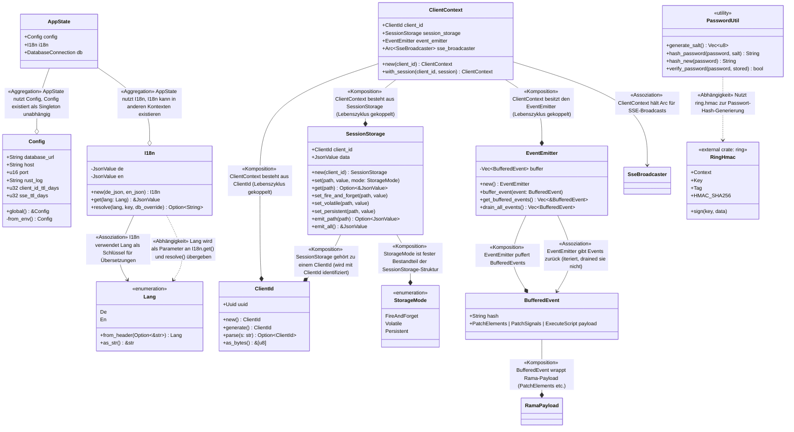
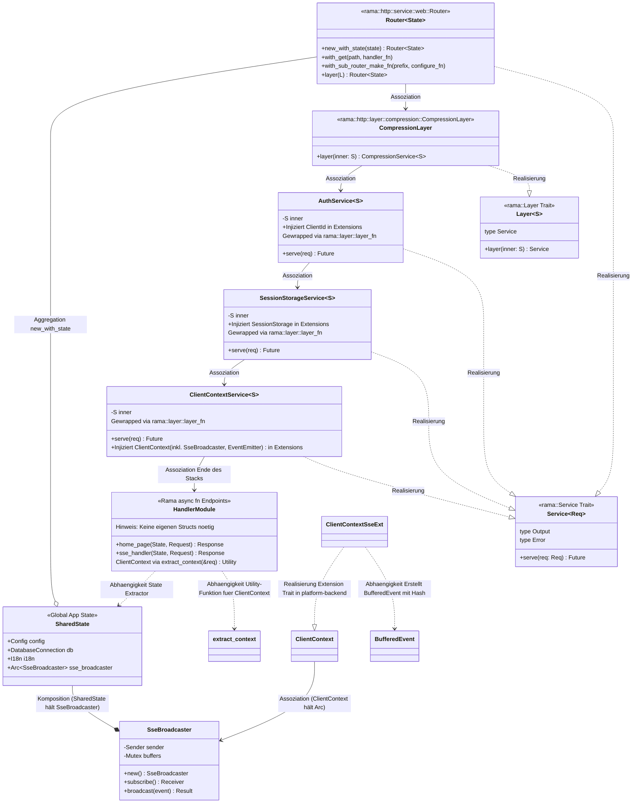
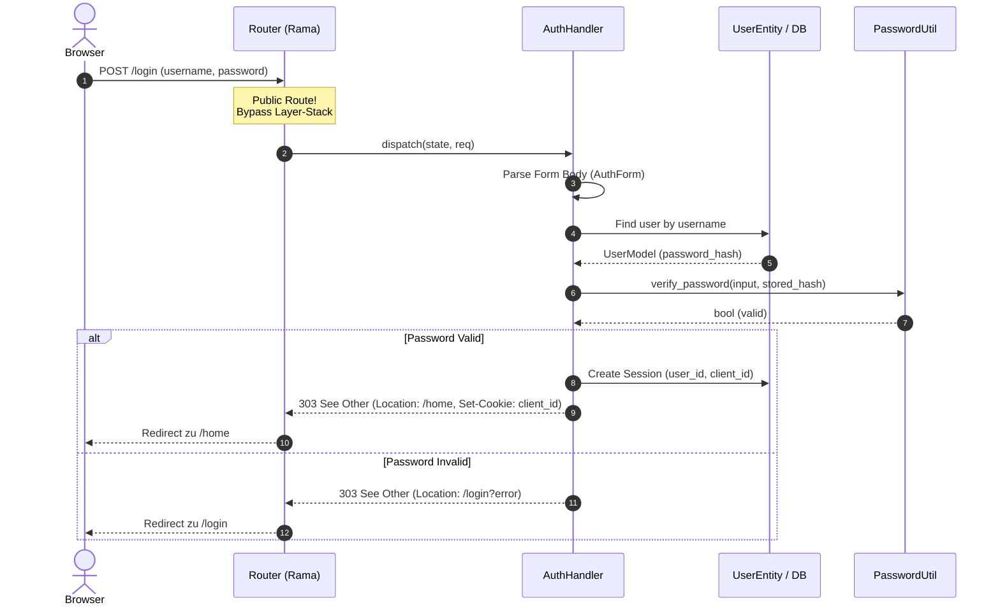
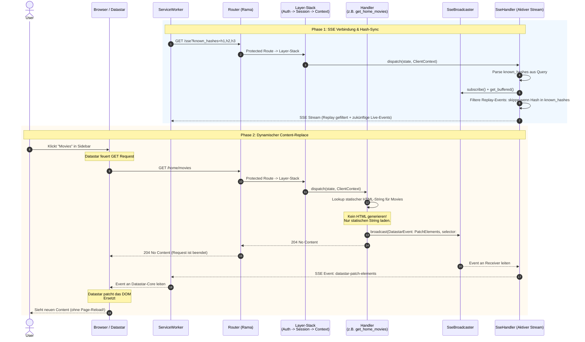
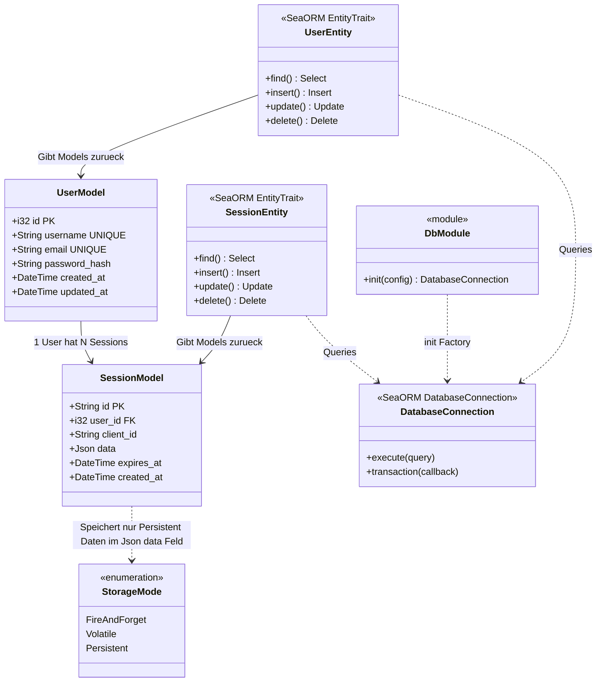
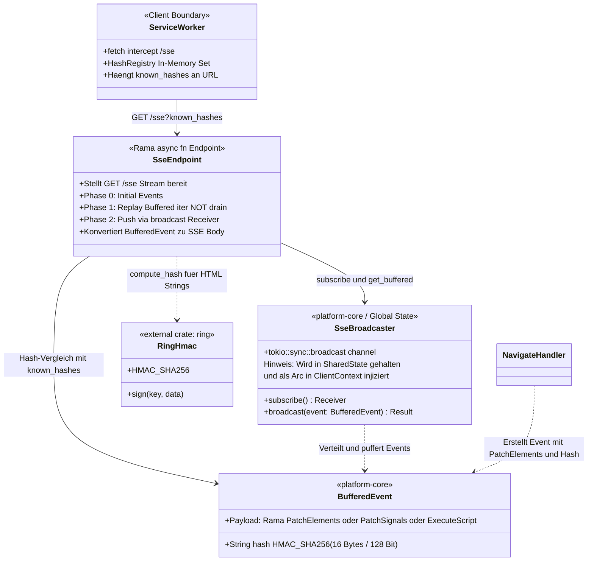
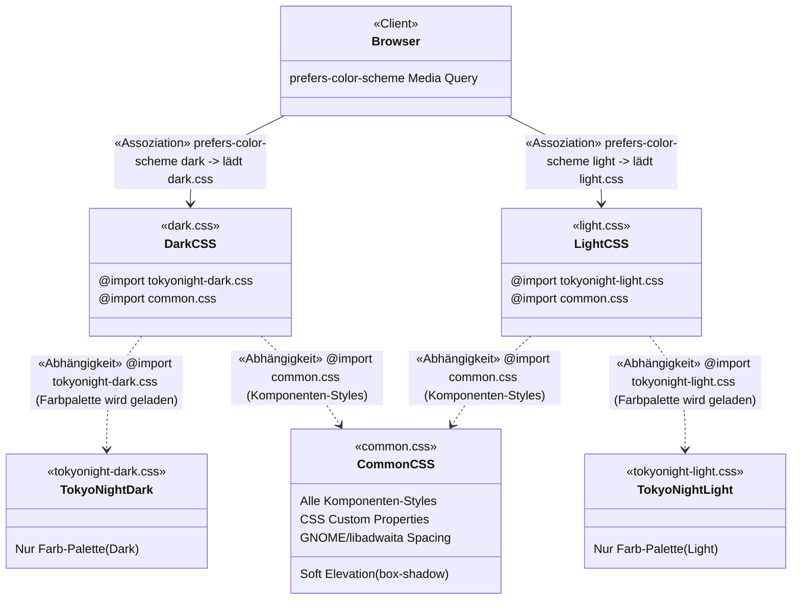
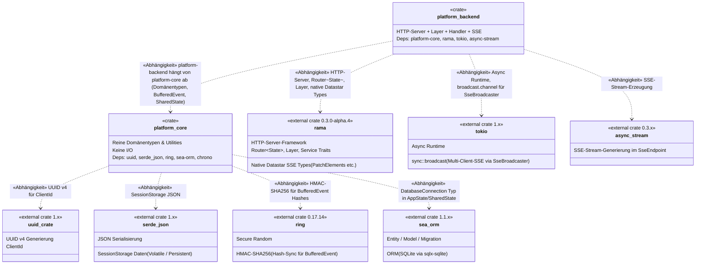

# UML-Klassendiagramm — Rama Platform (UML 2.x)

> **Stand:** 2025-07-14  
> **Basis:** `references/architecture.md`, `references/prompt.md`, `references/todo.md`  
> **Notation:** UML 2.x — Jede Beziehung ist explizit mit ihrem UML-Typ benannt.  
> **Hinweis:** Dieses Diagramm folgt der konzeptionellen Architektur, nicht der exakten Implementierung.

---

## UML 2.x — Legende der Beziehungstypen in Mermaid.js

| UML 2.x Typ (DE) | UML 2.x Typ (EN) | Mermaid-Syntax | Semantik |
|-------------------|-------------------|----------------|----------|
| **Assoziation** | Association | `A --> B` | Strukturelle Beziehung: A kennt B, kommuniziert mit B. Keine Ownership. |
| **Aggregation** | Aggregation | `A --o B` | Schwache Ganzes-Teil-Beziehung: A enthält B, aber B kann unabhängig existieren. |
| **Komposition** | Composition | `A --* B` | Starke Ganzes-Teil-Beziehung: A ist aus B zusammengesetzt. B kann ohne A nicht existieren. |
| **Vererbung / Generalisierung** | Inheritance / Generalization | `A --\|> B` | „ist ein": A erbt von B (Subtyp ← Supertyp). |
| **Abhängigkeit** | Dependency | `A ..> B` | Nutzungsbeziehung: A benutzt B (temporär, z. B. als Parameter oder lokale Variable). |
| **Realisierung** | Realization | `A ..\|> B` | „erfüllt Vertrag": A implementiert Schnittstelle/Trait B. |

---

## 1. Gesamtarchitektur — Paketdiagramm

```mermaid
classDiagram
    direction TB

    namespace platform_core {
        class ClientId
        class Config
        class I18n
        class Lang
        class SessionStorage
        class StorageMode
        class ClientContext
        class EventEmitter
        class BufferedEvent
        class SseBroadcaster
        class AppState
        class PasswordUtil
    }

    namespace platform_backend__server {
        class SharedState
        class ClientContextSseExt
    }

    namespace platform_backend__layers {
        class AuthService~S~
        class SessionStorageService~S~
        class ClientContextService~S~
    }

    namespace platform_backend__sse {
    }

    namespace platform_backend__handlers {
        class AuthHandler
        class SseHandler
        class PageHandler
        class I18nHandler
        class IconHandler
        class NavigateHandler
    }

    namespace platform_backend__entities {
        class UserEntity
        class SessionEntity
    }

    namespace rama_http__traits {
        class Layer~S~
        class Service~Req~
    }
```

---

## 2. Domänen-Kern — platform-core (Komposition, Assoziation, Abhängigkeit)



---

## 3. Server & Layer-Stack — platform-backend (Realisierung, Assoziation, Komposition)



**Anmerkungen zur Rama-Implementierung:**
*   **Bifurkation:** Die Trennung von Public- und Protected-Routes erfolgt nativ im `Router<State>` via `with_sub_router_make_fn`. Öffentliche Routen umgehen den Layer-Stack komplett.
*   **Layer-Erstellung:** Die Services (`AuthService`, `SessionStorageService`, `ClientContextService`) werden per `rama::layer::layer_fn` als Layer registriert (z.B. `.layer(layer_fn(|inner| AuthService::new(inner)))`). **Keine eigenen Layer-Structs** (`AuthLayer`, etc.) — nur die `*Service`-Implementierungen existieren.
*   **State vs. Context:** `SharedState` ist der globale App-Zustand (via `new_with_state` injiziert). `ClientContext` ist der per-Request-Zustand (wird von den Layern in `req.extensions()` injiziert) und enthält bereits `EventEmitter` + `Arc<SseBroadcaster>`.
*   **Handler:** Endpunkte sind lose `async fn` Funktionen. Sie extrahieren `SharedState` via `State(state)` und `ClientContext` via Utility-Funktion `extract_context(&req)` (nicht via `Ext`-Extractor).
*   **ClientContextSseExt:** In `platform-backend` definiertes Extension Trait, das `emit_patch()` auf `ClientContext` bereitstellt — wrappt Rama-Typen in `BufferedEvent` und broadcastet sie.


---


### Sequenzdiagramm 1: Login (`POST /login`)



**Kernpunkte:**
*   **Public Route:** Umgeht den Auth/Session-Layer-Stack komplett.
*   **Validierung:** Strikte Trennung von DB-Lookup und Hash-Verifikation (via `PasswordUtil`).
*   **Antwort:** Immer `303 See Other` (Post/Redirect/Get-Pattern).
    *   *Erfolg:* Redirect zu `/home` + Setzen des Session-Cookies.
    *   *Fehler:* Redirect zurück zum Login-Formular mit Error-Query.

---

### Sequenzdiagramm 2: `/home` & Sidebar-Navigation (SSE & Datastar)



**Kernpunkte:**
*   **Phase 1 (SSE Connect):**
    *   SW sendet `known_hashes` beim Verbindungsaufbau.
    *   Backend filtert Replay-Events exakt auf diese Hashes (verhindert redundante DOM-Patches).
*   **Phase 2 (Navigation):**
    *   GET-Request (z.B. `/home/movies`) durchläuft den Layer-Stack.
    *   Handler lädt **statisches HTML** (keine String-Generierung zur Laufzeit).
    *   Handler broadcastet `DatastarEvent` (PatchElements) an den `SseBroadcaster`.
    *   **Sofortige Antwort:** `204 No Content` (non-blocking, Request ist beendet).
    *   Asynchroner Push: Content-Update läuft isoliert über den bestehenden SSE-Stream -> Datastar patched den `#content` Selektor.
---


## 6. SeaORM-Entities — Persistenzschicht



**Anmerkungen zur Persistenzschicht:**

*   **Login-Strategie:** Der Login erfolgt exklusiv über das `email` Feld. Der `username` dient rein der Anzeige im UI.
*   **StorageMode Mapping:** Das `Json data` Feld in `SessionModel` persistiert *nur* die Werte aus dem `SessionStorage`, die mit `StorageMode::Persistent` gesetzt wurden. Werte mit `StorageMode::Volatile` (im RAM gehalten, weg bei Serverneustart) oder `FireAndForget` (einmalig emittiert) werden nicht in dieses Feld geschrieben.
*   **Keine ActiveModels:** Das ORM-spezifische `ActiveModel`-Pattern (für Change-Tracking bei Updates) wurde aus dem Architektur-Diagramm entfernt.

---


## 7. SSE / Hash-Sync — Datenfluss



**Anmerkungen zur SSE / Hash-Sync Architektur:**

*   **Das `BufferedEvent` als Brücke:** Ramas native Typen (`PatchElements`, etc.) haben kein Feld für unseren Custom-Hash. Das `BufferedEvent` (in `platform-core`) ist unser architektonischer Adapter: Es verpackt den Rama-Payload zusammen mit dem HMAC-Hash (16 Bytes / 128 Bit, hex-enkodiert). Erst ganz am Ende (im `SseEndpoint`) wird es in das finale SSE-Format übersetzt.
*   **Warum HMAC und nicht `impl Hash`?:** Rusts Standard-Hasher ist randomisiert (Schutz vor Hash-DoS). Der Hash wäre nach einem Server-Neustart anders, was den Sync mit den `known_hashes` des ServiceWorkers unbrauchbar machen würde. Daher zwingend deterministischer Hash via `ring::hmac::HMAC_SHA256`.
*   **`SseBroadcaster` Definition:** Liegt in `platform-core`, da `ClientContext` (in core) einen `Arc<SseBroadcaster>` hält. Wird von `SharedState` (in backend) einmalig erstellt und als `Arc` sowohl in `SharedState` als auch in jeden `ClientContext` (via `ClientContextService`) injiziert. Nutzt `tokio::sync::broadcast` für Multi-Client-SSE.
*   **`SseEndpoint` statt Handler:** Der Name verdeutlicht: Hier geht es um eine langelebige, offene Stream-Verbindung, nicht um einen kurzen Request/Response-Cycle. Er ist der einzige Konsument, der Ramas `DatastarEvent`-Stream tatsächlich über die Leitung schreibt.
*   **Trennung von Zuständigkeit:** Der `SseBroadcaster` ist "dumm" und verteilt Events nur an alle Receiver. Die Intelligenz (Vergleich: "Kennt der SW diesen Hash schon?") liegt ausschließlich im `SseEndpoint`, bevor dieser das Event auf die Leitung legt.


---

## 8. CSS-Architektur (Abhängigkeit)



---


## 9. Crate-Abhängigkeitsgraph (Abhängigkeit zwischen Crates)



---

## 10. Zusammenfassung der verwendeten UML 2.x Beziehungstypen

| Beziehungstyp | Mermaid | Vorkommen im Diagramm (aktualisiert auf Rama-Native Architektur) |
|---------------|---------|-----------------------|
| **Komposition** | `A --* B` | `ClientContext --* ClientId`, `ClientContext --* SessionStorage`, `ClientContext --* EventEmitter`, `SessionStorage --* ClientId`, `SessionStorage --* StorageMode`, `EventEmitter --* BufferedEvent`, `BufferedEvent --* RamaPayload` (PatchElements etc.), `SharedState --* SseBroadcaster`, `UserModel --> SessionModel` (1 zu n DB Zusammensetzung) |
| **Aggregation** | `A --o B` | `SharedState --o Config`, `SharedState --o I18n`, `Router~State~ --o SharedState` (via `new_with_state`) |
| **Assoziation** | `A --> B` | `I18n --> Lang`, `Router~State~ --> CompressionLayer`, `CompressionLayer --> AuthService`, `AuthService --> SessionStorageService`, `SessionStorageService --> ClientContextService`, `ClientContextService --> HandlerModule`, `ServiceWorker --> SseEndpoint`, `SseEndpoint --> SseBroadcaster`, `ClientContext --> SseBroadcaster` (Arc), `UserEntity --> UserModel`, `SessionEntity --> SessionModel` |
| **Vererbung / Generalisierung** | `A --\|> B` | *(Im Projekt nicht verwendet — Rust setzt auf Traits statt Klassenvererbung)* |
| **Abhängigkeit** | `A ..> B` | `I18n ..> Lang`, `PasswordUtil ..> RingHmac`, `HandlerModule ..> SharedState` (State Extractor), `HandlerModule ..> extract_context` (Utility-Funktion), `ClientContextSseExt ..> BufferedEvent`, `NavigateHandler ..> SseBroadcaster`, `NavigateHandler ..> BufferedEvent`, `SseEndpoint ..> RingHmac`, `SseEndpoint ..> BufferedEvent`, `SseBroadcaster ..> BufferedEvent`, `DbModule ..> DatabaseConnection`, `UserEntity ..> DatabaseConnection`, `SessionEntity ..> DatabaseConnection`, `DarkCSS ..> TokyoNightDark`, `DarkCSS ..> CommonCSS`, `LightCSS ..> TokyoNightLight`, `LightCSS ..> CommonCSS`, `platform_backend ..> platform_core`, etc. |
| **Realisierung** | `A ..\|> B` | `CompressionLayer ..\|> Layer`, `AuthService ..\|> Service`, `SessionStorageService ..\|> Service`, `ClientContextService ..\|> Service`, `Router~State~ ..\|> Service` (Native Rama Implementierung), `ClientContextSseExt ..\|> ClientContext` (Extension Trait) |
